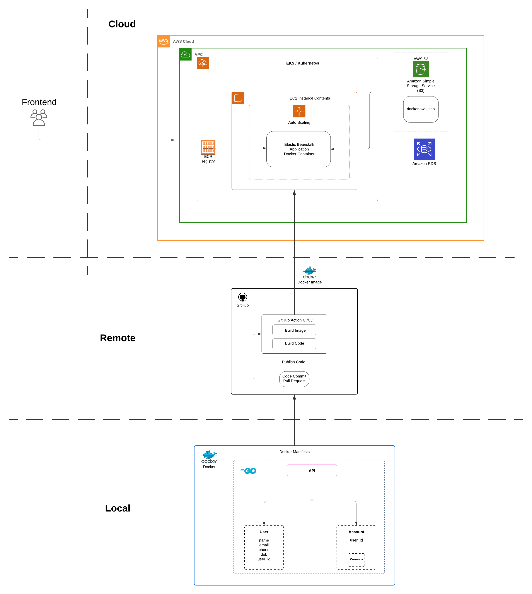

# bank-simulator-backend
[](https://codecov.io/github/Petatron/bank-simulator-backend)
[](https://goreportcard.com/report/github.com/Petatron/bank-simulator-backend)
[](https://pkg.go.dev/github.com/Petatron/bank-simulator-backend)
[](https://dev.azure.com/Petatron/bank_simulator_backend/_build/latest?definitionId=6&branchName=main)



This project aimed to build the backend of a bank simulator system. The system features include:

- General user/account's CUDR.
- Retrieve the bank account info owned by users.
- Making transactions between two accounts.
- Retrieve transactions records from user and its accounts.

## Table of Contents

- [Installation](#installation)
- [Usage](#usage)
- [MakeFile](#makefile)
- [Future Work](#future-work)

### 1. Installation

Get latest production code:

```bash
git clone https://github.com/Petatron/bank-simulator-backend.git
```

Install three basic required environment:

- [Go installation](https://go.dev/dl/)
- [Docker installation](https://www.docker.com/)
- Postman or any other API testing tool.

It is recommand to use `Homebrew` to manage and install if you are using Linux or try to use them on terminal. (Please make sure you have installed `Homebrew` before run below commands.)

```bash
brew install go
brew install docker
```

### 2. Usage

#### Project Setup

The project used MakeFile to set up docker image and migrate database to docker container. 
After the environment tools installed Run the following commands to set up the project:

```bash
# Pull docker image and start docker container.
make postgres
# Create database and set up username and password.
make createdb
# Create tables
make migrateup
```

To start the server, run the following command:
```bash
go run main.go
```

#### API Endpoints

The project provides the following API endpoints:

- `GET /users`: Retrieve all users.
- `GET /users/{id}`: Retrieve a user by its id.
- `POST /users`: Create a new user.
- `PUT /users/{id}`: Update a user by its id.
- `DELETE /users/{id}`: Delete a user by its id.
- `GET /users/{id}/accounts`: Retrieve all accounts owned by a user.

In `Postman`or any other API testing tool, you can use the following API endpoints to interact with the system:
- `Create a new user`: `POST http://localhost:8080/users`
```json
{
    "username": "",
    "full_name": "",
    "email": "",
    "password": ""
}
```
- `User login`: `POST http://localhost:8080/users/login`
```json
{
    "username": "",
    "password": ""
}
```

Version 1.0.3
